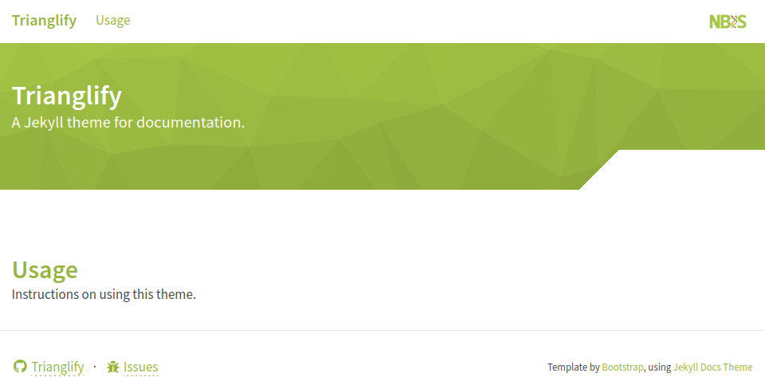

# Trianglify

A Jekyll theme based on [this](https://github.com/allejo/jekyll-docs-theme). View the demo [here](https://royfrancis.github.io/jekyll-theme-trianglify).



To use this theme, add this line to your Jekyll site's `_config.yml`:

```yaml
remote_theme: royfrancis/jekyll-theme-trianglify@v{{ site.project.version }}
```

## License

The theme is available as open source under the terms of the [MIT License](./LICENSE.md).
